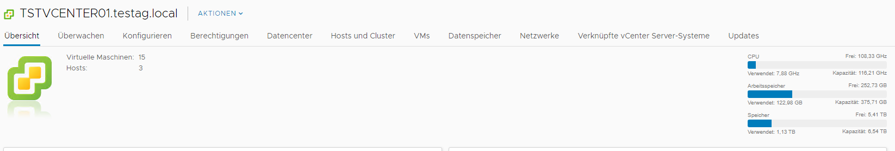
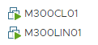

#  M300-Services

## Dokumentation

### Einleitung
In diesem Dokument werden alle Arbeiten weitesgehend dokumentiert.

## Inhaltsverzeichnis
* Einrichtung / Vorbereitung
* 10 Toolumgebung aufsetzen
* 20 Infrastruktur-Automatisierung
* 25 Sicherheit
* 30 Container
* 35 Sicherheit
* 40 Kubernetes (k8s)
* 80 Ergänzungen zu den Unterlagen

## 10 Toolumgebung
### 01 - Github Account
#### Account erstellen
1. Als erstes wurde über die Seite https://github.com ein Account mit der TBZ Mailadresse erstellt.

2. Anschliessend den Account verifizieren und schon können Repositorys etc erstellt werdenn.

#### Repository erstellen

Als nächstes muss ein Repository erstellt werden. Ein Repository ist eine Art Speicher für ein Projekt. Hier die Schritte dazu:

1. Anmelden unter www.github.com
2. Auf der Willkommensseite ein neues Repository erstellen
3. Nun einen Namen angeben, in meinem Fall M300-Services
5. Nun kann festgelegt werden wer alles auf dieses Repository schauen / Dinge bearbeiten kann. Wie in der Aneltigun beschriebn wird diese Einstellung auf Public belassen.
6. Nun muss nur noch das Häkchen bei create README File gesetzt werden und schon kann das Repository erstellt werden.

#### SSH-Key erstellen

1. Terminal Bash öffnen
2. Den Befehl eingeben mit der Emailadresse des Github Accounts:

```
 $ ssh-keygen -t rsa -b 4096 -C 'DEINE EMAILADRESSE' 
```

3. Danach wird ein Key erstellt und man muss mit Enter bestätigen.

4. Nun erstellt man ein Passwort.

#### SSH-Key hinzufügen

1. Anmelden unter www.github.com
2. Auf Benutzerkonto klicken (oben rechts) und den Punkt Settings aufrufen
3. Unter den Menübereichen auf der linken Seite zum Abschnitt SSH und GPG keys wechseln
4. Auf New SSH key klicken
5. Im Formular unter Title eine Bezeichnung vergeben (z.B. MB SSH-Key)
6. Den zuvor kopierten Key mit CTRL + V einfügen und auf Add SSH key klicken
7. Der Schlüssel (SSH-Key) sollte nun in der übergeordneten Liste auftauchen

### 02 - Git Client

Jetzt muss der Git Client installiert werden. Dieser ermöglicht uns, 

Hierzu müssen folgende Schritte durchgeführt werden:

1. Git Client installieren
2. Konfigurieren des Git Clients

| Befehle      |    Bedeutung    |
| ------------- |:-------------:|
| $ git config --global user.name <username>       |      Den Github Usernamen angeben  |
| $ $ git config --global user.email <e-mail>   | Die im Github verwendete Mail angeben

3. Konfiguration abgeschlossen

#### Repository klonen

1. Terminal öffnen

Mit dem folgenden Befehl kann das Repository geklont werden:

```
| $ git clone https://github.com/jeroondeg/M300-Services/
```

Mit diesem Befehl kann der Status angezeigt werdenk, dies ist nützlich zum anzeigen ob das Repository aktuell ist, oder wenn Probleme gibt beim Changes pushen:
```
$ git pull
```

Mit dem folgenden Befehl werden Geänderte Datei(en) werden rot aufgelistet:

```
 $ git status
```

#### Repository herunteraden
Dieser Befehl ist wichtig, damit die Änderungen lokal gemacht werden können und anschliessen einfach auf Github hochgeladen werden kömmem. Dazu hier die Schritte: 

1. Terminal Bash öffnen
2. Ordner im gewünschtenn Verzeichnis erstellen
3. Repository mit SSH klonen:

```
 $ git clone git@github.com:jeroondeg/M300-Services.git
```

#### Repository pushen (hochladen)

1. Terminal Bash öffnen
2. Zum Verzeichnis gehen des repository
3. Dateien dem Upload hinzufügen:

```
$ git add -a
```
Upload wird "commited" > Kommentar zu Dokumentationszwecken ist dafür notwendig

4. Upload commiten:

Dieser Schritt soll zukünftig mit dem Markdown Editor gemacht werden, aber für den Moment wäre dies der Schritt um ein Update zu commiten:
```
 $ git commit -m "Mein Kommentar"
```


1. Zum Schluss noch pushen, mit diesem Befehl werden die Changes endgültig in das Github Repository hochgeladen:
```
$ git push
```

### 03 - VirtualBox
In diesem Abschnitt geht es um eine Basic Installation eines Linux über Virtualbox. Ich mache alles auf einer ESXi Umgebung, welche aus 3 ESXi besteht. Dementsprechend habe ich auf dieser Umgebung viel Ressourcen, deshalb habe ich diesen Schritt über ESXi erledigt. Ich werde nicht weiter darauf eingehen, wie ich das gemacht habe, da jeder mittlerweile eine VM aufsetzen kann. Hier einmal ein Screenshot von der ESXi Umgebung:



Und hier noch ein Screenshot von der M300 Infrastrukut Stand jetzt:


### 04 - Vagrant

Wenn man schon einmal selber die VM's erstellt hat, dann weiss man für mehrere braucht man lange. Für eine schnellere Variante gibt es Vagrant. Mit dem können VM's automatisch erstellt werden mit nur einem kurzen Code.

Im gewünschten Verzeichnis kann man mit einer Zeile, die VM erzeugen:

Mit diesem Befehl wird das Vagrant File erstellt, welches notwendig ist um danach die VMs von Vagrant auf zu erstellen:
```
$ vagrant init ubuntu/xenial64
```

Nach einiger Wartezeit sollte der Befehl erfolgreich durchgelaufen sein, danach kann die VM mit dem folgendem Befehl gestartet werden:
```
$ vagrant up --provider virtualbox
```

### 05 - Visual Studio Code

Einige der Klasse haben sich dazu entschieden nicht mit Visual Studio Code zu arbeiten, ich hingegen mag es mit Visual Studio Code zu arbeiten, demanch wurde alles gemäss der Anleitung installiert das beinhaltet folgende Schritte:

Zuerst wurden folgenden Extensions installiert:

* Markdown All in One (von Yu Zhang)
* Vagrant Extension (von Marco Stanzi)
* vscode-pdf Extension (von tomiko1207)

Nun muss die folgende Datei bearbeitet werden:  `File` > `Preferences` > `Settings` (`Ctrl` + `,`) auf `Open setting.json`, nun sollte theoretisch ein Fenster sich öffnen. Dieses noch leere Fenster wurde mit dem folgendem Code erweitert:

```
      // Konfiguriert die Globmuster zum Ausschließen von Dateien und Ordnern.
      "files.exclude": {
        "**/.git": true,
        "**/.svn": true,
        "**/.hg": true,
        "**/.vagrant": true,
        "**/.DS_Store": true
      },
```

## 20 - Infrastruktur-Automatisierung

## 25 Sicherheit

## 30 Container

## 35 Sicherheit

## 40 Kubernetes (k8s)

## 80 Ergänzungen zu den Unterlagen