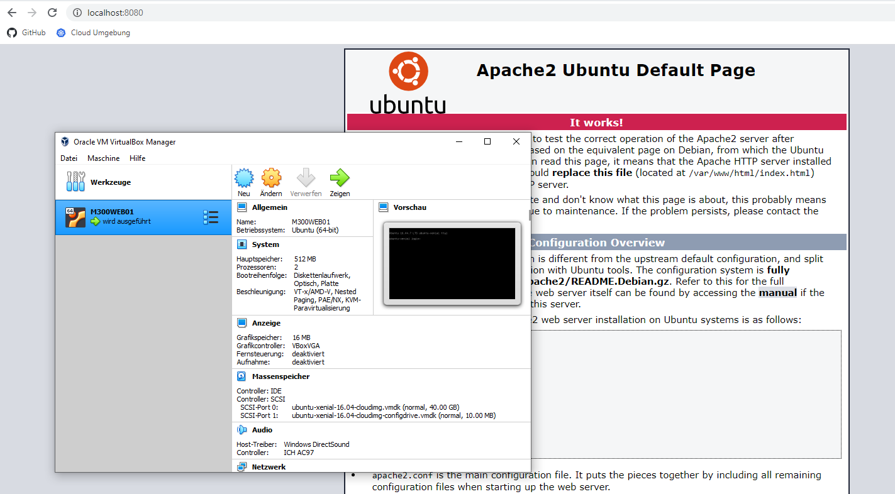
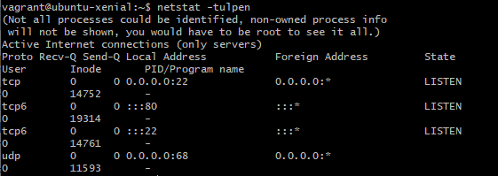
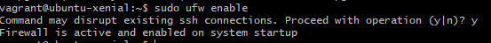
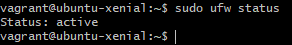
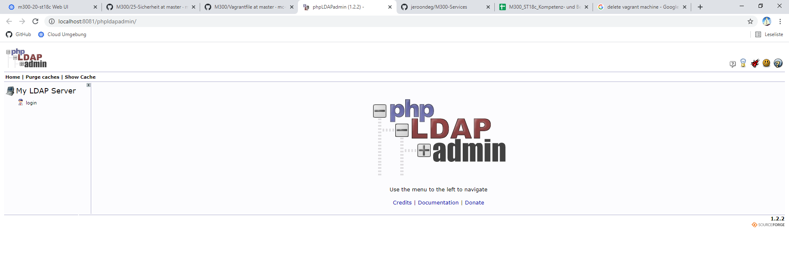

#  M300-Services

## Dokumentation

### Einleitung
In diesem Dokument werden alle Arbeiten weitesgehend dokumentiert.

## Inhaltsverzeichnis
* [10 Toolumgebung](#10-toolumgebung) 
* [20 Infrastruktur-Automatisierung](#20---infrastruktur-automatisierung)
* [25 Sicherheit](#25-Sicherheit)
* [30 Container](#30-Container)
* [35 Sicherheit](#35-Sicherheit)
* [40 Kubernetes (k8s)](#40-Kubernetes-(k8s))
* [80 Ergänzungen zu den Unterlagen](#80-ergänzungen-zu-den-unterlagen)

## 10 Toolumgebung
### 01 - Github Account
#### Account erstellen
1. Als erstes wurde über die Seite https://github.com ein Account mit der TBZ Mailadresse erstellt.

2. Anschliessend den Account verifizieren und schon können Repositorys etc erstellt werdenn.

#### Repository erstellen

Als nächstes muss ein Repository erstellt werden. Ein Repository ist eine Art Speicher für ein Projekt. Hier die Schritte dazu:

1. Anmelden unter www.github.com
2. Auf der Willkommensseite ein neues Repository erstellen
3. Nun einen Namen angeben, in meinem Fall M300-Services
5. Nun kann festgelegt werden wer alles auf dieses Repository schauen / Dinge bearbeiten kann. Wie in der Aneltigun beschriebn wird diese Einstellung auf Public belassen.
6. Nun muss nur noch das Häkchen bei create README File gesetzt werden und schon kann das Repository erstellt werden.

#### SSH-Key erstellen

1. Terminal Bash öffnen
2. Den Befehl eingeben mit der Emailadresse des Github Accounts:

```
 $ ssh-keygen -t rsa -b 4096 -C 'DEINE EMAILADRESSE' 
```

3. Danach wird ein Key erstellt und man muss mit Enter bestätigen.

4. Nun erstellt man ein Passwort.

#### SSH-Key hinzufügen

1. Anmelden unter www.github.com
2. Auf Benutzerkonto klicken (oben rechts) und den Punkt Settings aufrufen
3. Unter den Menübereichen auf der linken Seite zum Abschnitt SSH und GPG keys wechseln
4. Auf New SSH key klicken
5. Im Formular unter Title eine Bezeichnung vergeben (z.B. MB SSH-Key)
6. Den zuvor kopierten Key mit CTRL + V einfügen und auf Add SSH key klicken
7. Der Schlüssel (SSH-Key) sollte nun in der übergeordneten Liste auftauchen

### 02 - Git Client

Jetzt muss der Git Client installiert werden. Dieser ermöglicht uns, 

Hierzu müssen folgende Schritte durchgeführt werden:

1. Git Client installieren
2. Konfigurieren des Git Clients

| Befehle      |    Bedeutung    |
| ------------- |:-------------:|
| $ git config --global user.name <username>       |      Den Github Usernamen angeben  |
| $ $ git config --global user.email <e-mail>   | Die im Github verwendete Mail angeben

3. Konfiguration abgeschlossen

#### Repository klonen

1. Terminal öffnen

Mit dem folgenden Befehl kann das Repository geklont werden:

```
| $ git clone https://github.com/jeroondeg/M300-Services/
```

Mit diesem Befehl kann der Status angezeigt werdenk, dies ist nützlich zum anzeigen ob das Repository aktuell ist, oder wenn Probleme gibt beim Changes pushen:
```
$ git pull
```

Mit dem folgenden Befehl werden Geänderte Datei(en) werden rot aufgelistet:

```
 $ git status
```

#### Repository herunteraden
Dieser Befehl ist wichtig, damit die Änderungen lokal gemacht werden können und anschliessen einfach auf Github hochgeladen werden kömmem. Dazu hier die Schritte: 

1. Terminal Bash öffnen
2. Ordner im gewünschtenn Verzeichnis erstellen
3. Repository mit SSH klonen:

```
 $ git clone git@github.com:jeroondeg/M300-Services.git
```

#### Repository pushen (hochladen)

1. Terminal Bash öffnen
2. Zum Verzeichnis gehen des repository
3. Dateien dem Upload hinzufügen:

```
$ git add -a
```
Upload wird "commited" > Kommentar zu Dokumentationszwecken ist dafür notwendig

4. Upload commiten:

Dieser Schritt soll zukünftig mit dem Markdown Editor gemacht werden, aber für den Moment wäre dies der Schritt um ein Update zu commiten:
```
 $ git commit -m "Mein Kommentar"
```


1. Zum Schluss noch pushen, mit diesem Befehl werden die Changes endgültig in das Github Repository hochgeladen:
```
$ git push
```

### 03 - VirtualBox
In diesem Abschnitt geht es um eine Basic Installation eines Linux über Virtualbox. Ich mache alles auf einer ESXi Umgebung, welche aus 3 ESXi besteht. Dementsprechend habe ich auf dieser Umgebung viel Ressourcen, deshalb habe ich diesen Schritt über ESXi erledigt. Ich werde nicht weiter darauf eingehen, wie ich das gemacht habe, da jeder mittlerweile eine VM aufsetzen kann. Hier einmal ein Screenshot von der ESXi Umgebung:


Und hier noch ein Screenshot von der M300 Infrastrukut Stand jetzt:


### 04 - Vagrant

Wenn man schon einmal selber die VM's erstellt hat, dann weiss man für mehrere braucht man lange. Für eine schnellere Variante gibt es Vagrant. Mit dem können VM's automatisch erstellt werden mit nur einem kurzen Code.

#### Erste VM mit Vagrant aufsetzen

Im gewünschten Verzeichnis kann man mit einer Zeile, die VM erzeugen:

Mit diesem Befehl wird das Vagrant File erstellt, welches notwendig ist um danach die VMs von Vagrant auf zu erstellen:
```
$ vagrant init ubuntu/xenial64
```

Nach einiger Wartezeit sollte der Befehl erfolgreich durchgelaufen sein, danach kann die VM mit dem folgendem Befehl gestartet werden:
```
$ vagrant up --provider virtualbox
```
#### Automatisierten Webserver aufsetzen

Folgendes Szenario, man ist ein Hosting Unternehemn und man möchte, konstant VMs laufen haben, auf den das gleiche läuft. Natürlich könnte man dies per Hand machen, viel schneller geht dies jedoch wenn man ein Code hat, welches jeweils immer eine VM erstellt wenn man dieses ausführt.

In meinem Fall konnte ich automatisiert einen Webserver installieren, ausserdem habe ich darauf geachtet dass ich das Vagrantfile so anpasse, dass ich auch einen schönen VM Namen habe, natürlich müsste man dies dann auch im Linux anpassen, aber das ist dann eine reinse Config Datei Erweitertungs Sache.

Dafür wurde zuerst ein neuer Ordner erstellt, in dem ich die Apache Tests durchführen werde.

Danach wird das der folgende Code als Vagrantfile erstellt:

```
Vagrant.configure(2) do |config|
  config.vm.box = "ubuntu/xenial64"
  config.vm.network "forwarded_port", guest:80, host:8080, auto_correct: true
  config.vm.synced_folder ".", "/var/www/html"
config.vm.provider "virtualbox" do |vb|
   vb.name = "M300WEB01"
  vb.memory = "512"
end
config.vm.provision "shell", inline: <<-SHELL
  # Packages vom lokalen Server holen
  # sudo sed -i -e"1i deb {{config.server}}/apt-mirror/mirror/archive.ubuntu.com/ubuntu xenial main restricted" /etc/apt/sources.list
  sudo apt-get update
  sudo apt-get -y install apache2
SHELL
end
```

Mit diesem Code konnte ich die Linux Maschine M300WEB01 erstellen, ein test über den Browser über localhost:8080 hat gezeigt, dass der Webserver funktiniert:




### 05 - Visual Studio Code

Einige der Klasse haben sich dazu entschieden nicht mit Visual Studio Code zu arbeiten, ich hingegen mag es mit Visual Studio Code zu arbeiten, demanch wurde alles gemäss der Anleitung installiert das beinhaltet folgende Schritte:

Zuerst wurden folgenden Extensions installiert:

* Markdown All in One (von Yu Zhang)
* Vagrant Extension (von Marco Stanzi)
* vscode-pdf Extension (von tomiko1207)

Nun muss die folgende Datei bearbeitet werden:  `File` > `Preferences` > `Settings` (`Ctrl` + `,`) auf `Open setting.json`, nun sollte theoretisch ein Fenster sich öffnen. Dieses noch leere Fenster wurde mit dem folgendem Code erweitert:

```
       // Konfiguriert die Globmuster zum Ausschließen von Dateien und Ordnern.
      "files.exclude": {
        "**/.git": true,
        "**/.svn": true,
        "**/.hg": true,
        "**/.vagrant": true,
        "**/.DS_Store": true
      },
```

## 20 - Infrastruktur-Automatisierung

## 25 Sicherheit

### 01 - Firewall
In diesem Abschnitt wird die UFW Firewall installiert um einfache Firewall Regeln zu erstellen, damit unser Webserver nicht kompett ungeschützt ist.

Als erstes wird mit dem folgenden Befehl herausgefunden, welche Ports offen sind.

```
$ netstat -tulpen
```

Hier die Ausgabe:



Nun da da bekannt ist, welche Ports offen sind, kann die Firewall installiert werden:

```
sudo apt-get install ufw
```

Bei einigen Distributionen ist die Firewall jedoch Standardmässig schon installiert. Nun setze ich noch, dass der Service jeweils immer im Autostart ist.

```
$ sudo ufw enable
```

Hier die Ausgabe:



Bevor ich Firewall Regeln erstellt habe, wollte ich schauen was die aktuellen sind, hier die Ausgabe:



Nun wurden folgende Rules angelegt:

```
# Port 80 (HTTP) öffnen für alle
vagrant ssh web
sudo ufw allow 80/tcp
exit

# Port 22 (SSH) nur für den Host (wo die VM laufen) öffnen
vagrant ssh web
sudo ufw allow from 10.10.30.10 to any port 22
exit

# Port 3306 (MySQL) nur für den web Server öffnen
vagrant ssh database
sudo ufw allow from  10.0.2.15 to any port 3306
exit
```

Der Zugriff wurde danach erfolgreich getestet. Anschliessend wurden alle Regeln wieder gelöscht.

### 02 - Reverse Proxy

Für diese Aufgabe habe ich wieder den Webserver gestartet. Folgende zwei Packages wurden noch installert:
```
$ sudo apt-get install libapache2-mod-proxy-html
$ sudo apt-get install libxml2-dev
```


Danach müssen mehrere Services aktiviert werden, dies kann man mit den folgenden Befehlen machen:

```
$ sudo a2enmod proxy
$ sudo a2enmod proxy_html
$ sudo a2enmod proxy_http 
```

Anschliessend einmal den Apache Server neustarten und schon kann man Proxy Einstellungen vornehmen. Ich habe zum Beispiel folgendes konfiguriert auf meinem M300WEB03:

```
# Allgemeine Proxy Einstellungen
ProxyRequests Off
<Proxy *>
   Order deny,allow
   Allow from all
</Proxy>

# Weiterleitungen master
ProxyPass /master http://master
ProxyPassReverse /master http://master
```

### 03 - Benutzer
In diesem Abschnitt habe ich leider nichts neues dazu gelernt, da ich schon mehrmals mit Linux gearbeitet habe, war mir das meiste klar.

### 04 - SSH

Auch in diesem Abschnitt gibt es nicht viel zu dokumentieren.

### 05 - Authentifizierung & Autorisierung & LDAP

Einen Apache Server zu sichern habe ich bereits schon mit grösseren Applikationen etc. gemacht, deshalb gehe nicht allzugross auf dieses Kapitel ein, jedoch habe ich mich versucht in das nächste Thema ein bisschen mehr reinzukämpfen.

#### LDAP
Als erstes wurde das Vagrantfile von Github auf meine VM kopiert. Anschliessend wurde eine Vagrant VM auf der Datei erstellt. In diesem ganzen Modul habe ich auch stets immer auf eine gewisse Ordnung geachtet, sprich ich habe jeweils immer die VMs schön benannt, mein Markdown geführt etc.

Nun kann man die Funktionalität der VM testen, indem man die folgende URL aufruft: http://localhost:8081/phpldapadmin

Falls alles geklappt hat, sollte man das folgende Bild sehen:



Nun wurde zum einen ein User erstellt und zum anderen eine Gruppe, dies nicht über das Gui sondern als Import. Schlussendlich habe ich nun zwei Benutzer.

In einer Windows Domäne zum Beispiel, will man zum Teil, dass sich User mit einem einheitlichen LDAP Login an mehreren Orten einloggen können. Dies habe ich hier simuliert. Dazu habe ich auf dem Apache Server eine Login Maska erstellen lassen.

### 05 - Reflexion

Ich finde das Modul bis jetzt ok, ich weiss dass es aber mit den Arbeiten in LB02 viel interessanter werden wird, deshalb freue ich mich sehr. Bis jetzt habe ich schon viel gelernt. Ich denke, dass was wir bis Hier hin gemacht haben ist mehr oder weniger der Einstieg, das "Basiswissen". Ich hoffe dass ich mit meiner Zusatzarbeit zeigen konnte wie sehr ich das Modul eigentlich im Griff habe.


## 30 Container

## 35 Sicherheit

## 40 Kubernetes (k8s)

## 80 Ergänzungen zu den Unterlagen